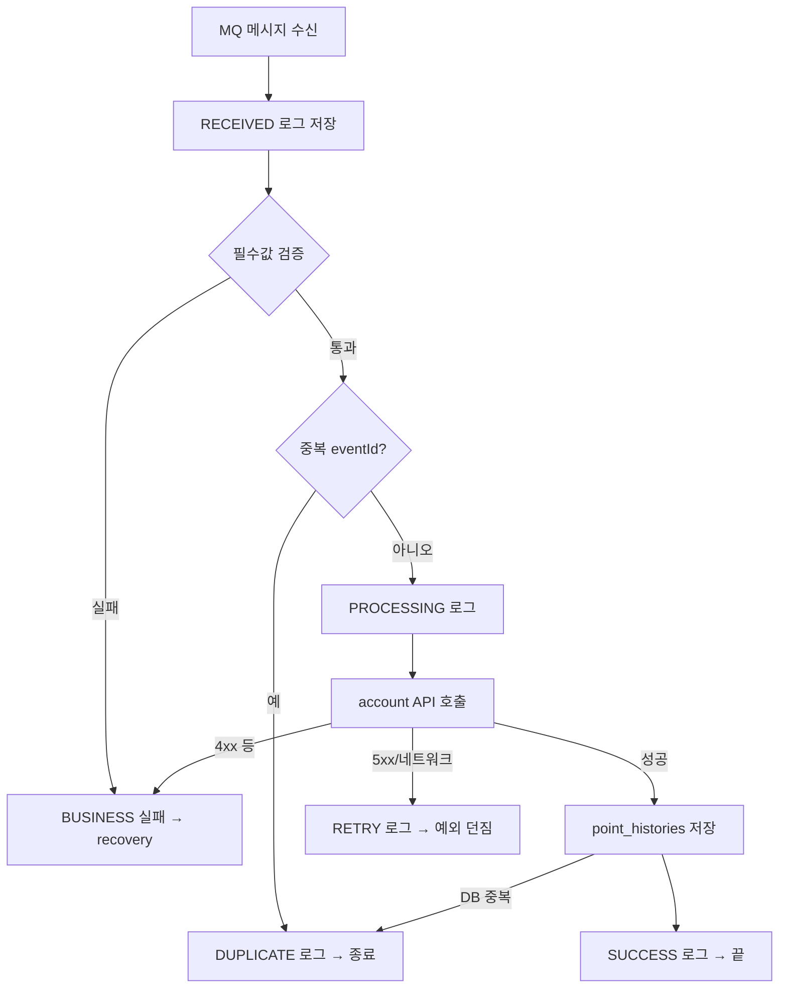

# UserPointChangedProcessService 설명

> 대상: `processing-service/src/main/java/com/hopoong/processing/consumer/user/point/service/UserPointChangedProcessService.java`  
> 포인트 변경 MQ 메시지(`USER_POINT_CHANGED` v2)를 실제로 처리하는 핵심 로직

---

## 한 줄 요약

**이 이벤트를 이미 처리했는지 확인하고 → account에 잔액 반영 요청 → 처리 이력 저장 → 실패하면 retry 또는 recovery로 넘긴다.**

RabbitMQ Consumer(`UserPointChangedConsumer`)가 메시지를 받으면, 최종적으로 이 클래스의 `processV2()`가 호출된다.

---

## 큐

| 구간 | 큐 | exchange / routing key | 비고 |
|------|-----|------------------------|------|
| 수신 (main) | `processing-service.user.point.changed.v2` | `user.events` / `user.point.changed` | `UserPointChangedConsumer`가 소비 |
| 실패 전달 (ingest) | `recovery-service.failed-messages.ingest` | `user.events` / `failed-messages.ingest` | `FailedMessagePublisher`가 발행 → recovery 적재 |
| DLQ 백업 | `processing-service.user.point.changed.v2.dlq` | main 큐 DLX | retry 소진 시 자동 유입, recovery가 백업 적재 |

```
order 발행 (user.events / user.point.changed)
  → processing-service.user.point.changed.v2  ← processV2() 처리
      ├─ 복구 불가 / retry 소진 → recovery-service.failed-messages.ingest
      └─ retry 소진 (DLX)     → processing-service.user.point.changed.v2.dlq
```

---

## 전체 흐름



---

## 단계별 설명

### 1. 시작 — `RECEIVED` 기록

메시지를 받았다는 사실을 `message_process_logs`에 먼저 남긴다.

### 2. 검증 — `validatePayload()`

`userId`, `orderId`, `pointType`, `changeAmount`, `balanceAfter`가 있는지 확인한다.  
없으면 **복구 불가(BUSINESS)** 오류로 처리한다.

### 3. 중복 검사 — `isDuplicateEvent()`

같은 `eventId`로 이미 처리됐는지 확인한다.

- `point_histories`에 이미 있거나
- `message_process_logs`에 `SUCCESS` / `DUPLICATE`가 있으면

→ **account 호출 없이** `DUPLICATE`로 끝낸다. (멱등성 보장)

### 4. 본 처리

1. `PROCESSING` 로그 저장
2. **account-service Internal API** 호출 → 실제 포인트 잔액 반영
3. `point_histories`에 처리 이력 저장
4. `SUCCESS` 로그 저장

### 5. 실패 처리 (catch 분기)

| 예외 | 의미 | 동작 |
|------|------|------|
| `DataIntegrityViolationException` | DB UK 충돌 (동시 처리 등) | 중복으로 처리 |
| `UserPointChangedProcessException` (retryable=false) | account 4xx 등 복구 불가 | `FAILED` 로그 + **recovery ingest 큐** publish, 예외 안 던짐 (ack) |
| `UserPointChangedProcessException` (retryable=true) | account 5xx, 타임아웃 | `RETRY` 로그 + **예외 재전파** → RabbitMQ가 다시 시도 |
| `IllegalArgumentException` | 잘못된 payload | BUSINESS 실패 → recovery |
| 그 외 `RuntimeException` | DB 오류 등 일시 장애 | `RETRY` 로그 + 예외 재전파 |

---

## 이 클래스의 책임

### 하는 일

- account API 호출 (잔액 반영 위임)
- `point_histories` 저장 (processing 쪽 처리 이력)
- `message_process_logs`로 처리 상태 추적

### 하지 않는 일

- 포인트 잔액 직접 수정 (account-service 담당)
- MQ retry 횟수 제어 (`ProcessingRabbitListenerConfig` + ErrorHandler 담당)
- 실패 메시지 DB 보관 (recovery-service가 ingest 큐로 수신)

---

## 결과별 요약

```
성공:     RECEIVED → PROCESSING → account OK → point_histories → SUCCESS

중복:     RECEIVED → (이미 처리됨) → DUPLICATE

복구 불가: RECEIVED → ... → FAILED → recovery ingest 큐

일시 오류: RECEIVED → ... → RETRY 로그 → 예외 throw → MQ 재시도
          (재시도 소진 후에는 ErrorHandler가 FAILED + ingest 처리)
```

---

## 관련 코드

| 역할 | 클래스 |
|------|--------|
| MQ 수신 | `UserPointChangedConsumer` |
| 본 처리 | `UserPointChangedProcessService` |
| account 호출 | `AccountPointApplyClient` |
| 실패 ingest 발행 | `FailedMessagePublisher` |
| RETRY/FAILED 로그 | `MessageProcessFailureRecorder` |
| BUSINESS 실패 ErrorHandler | `RabbitListenerErrorHandlerConfig` |

전체 흐름: [user-point-changed.md](./user-point-changed.md)
