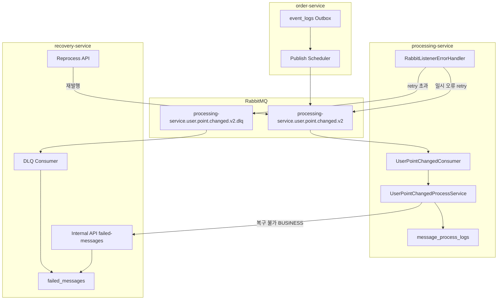

# recovery-service 초기 구현 가이드

> **기준 아키텍처:** [v2_plan.md](../v2_plan.md) 섹션 8 (recovery-service 연동)
>
> **전략:** processing 소비 실패의 최종 저장소 + DLQ 연계 + 재처리 허브

---

## 문서 목록

| 순서 | 문서 | 목적 |
|------|------|------|
| 1 | [phase-01-recovery-bootstrap-and-ingest-api.md](phase-01-recovery-bootstrap-and-ingest-api.md) | recovery-service 기반 + failed-messages 적재 API |
| 2 | [phase-02-dlq-and-processing-failure-handling.md](phase-02-dlq-and-processing-failure-handling.md) | MQ DLQ 인프라 + processing 실패 분기 + DLQ Consumer |
| 3 | [phase-03-reprocess.md](phase-03-reprocess.md) | 재처리 서비스 + reprocess API |
| 4 | [phase-04-docs-and-e2e.md](phase-04-docs-and-e2e.md) | 프로세스 문서·E2E 검증·v2_plan 체크리스트 완료 |

**의존 관계:** [v2-migration Phase 3](../v2-migration/phase-03-processing-service.md) 완료 후 → Phase 1 → 2 → 3 → 4

---

## 전체 아키텍처 (타겟)

- **하이브리드 연동** — 복구 불가 실패는 Internal API, retry 소진은 DLQ Consumer
- **order Outbox 재시도와 분리** — `event_logs` 발행 실패는 recovery 범위 밖
- Phase 2 완료 시점부터 processing 실패가 `failed_messages`로 이어짐

---

## Phase별 영향

| Phase | recovery-service | processing-service | core-service | MQ |
|-------|------------------|-------------------|--------------|-----|
| 1 | **기반 + 적재 API** | — | — | — |
| 2 | DLQ Consumer | **실패 분기·recovery 호출** | **DLQ Bean** | DLQ binding |
| 3 | **재처리 API** | — | — | 재발행 |
| 4 | 문서 | 문서 동기화 | — | — |

---

## recovery-service 역할 (요약)

| 책임 | 테이블/리소스 |
|------|---------------|
| 실패 메시지 영구 보관 | `failed_messages` |
| DLQ 메시지 수신·DB 동기화 | RabbitMQ DLQ 큐 |
| 재처리(reprocess) | 원본 exchange/routing_key 재발행 |
| 운영 조회 | Internal API |

**범위 밖:** order-service `event_logs` Outbox 발행 실패 (`EventPublishStatus.FAILED`)

---

## 현재 상태 (구현 gap)

| 영역 | 상태 |
|------|------|
| recovery-service | Boot 앱 + `FailedMessage` 엔티티만 존재 |
| DB 스키마 | `V1__create_tables.sql` `failed_messages` 정의 완료 |
| processing 실패 처리 | `FAILED` 기록 후 예외 rethrow — RETRY/DLQ·retry_count 미사용 |
| RabbitMQ DLQ | `RabbitMqKeys` 상수만, Queue Bean·binding **미구현** |

**핵심 갭:** processing 실패가 `FAILED + rethrow`에서 끊기고, recovery로 이어지는 파이프라인이 없음.

---

## 시나리오 요약

| ID | 조건 | failure_type | recovery 경로 |
|----|------|--------------|-----------------|
| S1 | 정상 / 중복 | — | 미개입 |
| S2 | 4xx, payload 오류, 미지원 버전 | `BUSINESS` | Internal API → ack |
| S3 | 5xx, 네트워크, DB 일시 오류 | `SYSTEM` / `TIMEOUT` | retry → DLQ → Consumer |
| S4 | DLQ 메시지 | — | DLQ Consumer upsert |
| S5 | 재처리 요청 | — | reprocess API → main queue 재발행 |

상세 정책은 [phase-02](phase-02-dlq-and-processing-failure-handling.md)·[phase-03](phase-03-reprocess.md) 참고.

---

## 공통 주의사항

### 반드시 지킬 것

1. **`failed_messages` 소유권** — recovery-service만 INSERT/UPDATE (processing은 API 호출)
2. **멱등 키** — `(consumer_name, event_id)` UK 기준 upsert
3. **BUSINESS 실패 requeue 금지** — 무한 requeue 방지, API 적재 후 ack
4. **서비스 경계** — processing이 `failed_messages` 직접 INSERT 금지
5. **order Outbox 회귀 없음** — recovery 작업이 `event_logs` 재시도에 영향 주지 않음

### 참고 컨벤션

- [exception-handling-convention.md](../../convention/exception-handling-convention.md) — 비REST ack/retry/DLQ 정책
- [rabbitmq-key-convention.md](../../convention/rabbitmq-key-convention.md) — DLQ 네이밍 `{queue}.dlq`
- [commit-convention.md](../../convention/commit-convention.md) — **Phase 단위 커밋 권장**

### 커밋 area 예시

| Phase | area 예시 | 커밋 예시 |
|-------|-----------|-----------|
| 1 | `[recovery]` | `feat(recovery-service): [recovery] failed-messages 적재 API 및 기반 구축` |
| 2 | `[recovery]` `[point]` | `feat(processing-service): [point] 실패 분기 및 recovery 연동` |
| 3 | `[recovery]` | `feat(recovery-service): [recovery] failed-messages 재처리 API` |
| 4 | docs | `docs: recovery-service 프로세스 문서 및 E2E 검증 기준 갱신` |

### 구현 전 확정 권장 (Phase 2 착수 전)

1. **retry 메커니즘:** Spring AMQP `RetryInterceptor` vs RabbitMQ TTL+DLX — 하나로 통일
2. **BUSINESS 실패 시 message_process_logs 상태:** `FAILED` vs `DLQ`
3. **자동 reprocess 범위:** `BUSINESS`는 수동만, `SYSTEM`/`TIMEOUT`만 자동 (선택)

---

## 롤백 전략 (요약)

| 시점 | 롤백 |
|------|------|
| Phase 1 | recovery-service 미배포 — processing 기존 동작 유지 |
| Phase 2 | ErrorHandler revert → 기존 rethrow 동작 복구, DLQ 큐 purge (개발) |
| Phase 3 | reprocess API 비활성화 — `failed_messages` 조회만 유지 |
| Phase 4 | 문서 revert — 코드 영향 없음 |

상세는 각 Phase 문서의 **롤백** 섹션 참고.

---

## 관련 문서

- [v2_plan.md](../v2_plan.md) — 섹션 8 recovery-service 연동
- [v2-migration README](../v2-migration/README.md) — 선행 마이그레이션
- [tables.md](../../db/tables.md) — `failed_messages` 스키마

---

## 변경 이력

| 일자 | 내용 |
|------|------|
| 2026-06-29 | recovery-init Phase 문서 최초 작성 (plan.md 단일 문서에서 4 Phase로 분리) |
