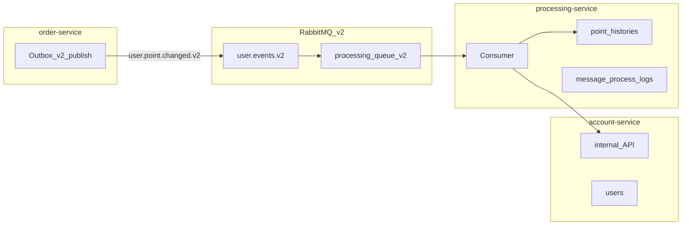

# v2 마이그레이션 실행 가이드

> **기준 아키텍처:** [v2_plan.md](../v2_plan.md) (processing 오케스트레이션 + account internal API)
>
> **전략:** order v2 발행 · processing 단독 소비 · v1 레거시 제거

---

## 문서 목록

| 순서 | 문서 | 목적 |
|------|------|------|
| 1 | [phase-01-core-and-order-v2.md](phase-01-core-and-order-v2.md) | v2 MQ 계약 + order v2 Outbox·발행 |
| 2 | [phase-02-account-internal-api.md](phase-02-account-internal-api.md) | account internal API (잔액 반영) |
| 3 | [phase-03-processing-service.md](phase-03-processing-service.md) | processing-service v2 Consumer·오케스트레이션 |
| 4 | [phase-04-legacy-cleanup.md](phase-04-legacy-cleanup.md) | v1 레거시 코드·MQ·문서 정리 |

**의존 관계:** Phase 1 → 2 → 3 → 4

---

## 전체 아키텍처 (타겟)

- **v2 routing key 분리** — v1 account Consumer가 잔존해도 v2 메시지를 수신하지 않음
- **cutover Phase 없음** — Phase 3 E2E 완료 시점부터 v2가 유일 처리 경로
- Phase 4에서 v1 dead code·MQ 리소스 정리

---

## Phase별 영향

| Phase | order-service | account | processing | MQ |
|-------|---------------|---------|------------|-----|
| 1 | **v2 발행** | REST 유지, v1 Consumer 무관 | — | v2 exchange·queue·binding |
| 2 | v2 발행 | internal API 추가 | — | v2 유지 |
| 3 | v2 발행 | internal API | **v2 Consumer 구현** | v2 유지 |
| 4 | v2 발행 | v1 Consumer·PointHistory **제거** | 운영 | v1 큐·binding **제거** |

---

## 공통 주의사항

### 반드시 지킬 것

1. **order-service v2 발행** — `EventVersions.V2`, `user.events.v2`, `user.point.changed.v2`
2. **MQ v2 계약 단일화** — `PROCESSING_QUEUE` fan-out 패턴 사용 금지
3. **서비스 경계** — processing이 `users` 직접 수정 금지, account가 `point_histories` 접근 금지
4. **멱등 키** — processing `event_id` 단일 (`point_histories`·`message_process_logs`)
5. **in-flight Outbox** — v1 `event_logs` drain 또는 purge 후 v2 전환 (Phase 1)

### 참고 컨벤션

- [exception-handling-convention.md](../../convention/exception-handling-convention.md) — REST `CoreException`, 비REST 도메인 예외
- [rabbitmq-key-convention.md](../../convention/rabbitmq-key-convention.md) — queue는 consumer 소유권 기준
- [commit-convention.md](../../convention/commit-convention.md) — **Phase 단위 커밋 권장**

### 커밋 area 예시

| Phase | area 예시 | 커밋 예시 |
|-------|-----------|-----------|
| 1 | `[key]` | `feat(core-service): [key] UserPointChanged v2 MQ 계약 및 order v2 발행` |
| 2 | `[user]` 또는 `[point]` | `feat(account-service): [point] UserPointChanged internal API 추가` |
| 3 | `[point]` | `feat(processing-service): [point] UserPointChanged v2 소비·오케스트레이션 구현` |
| 4 | chore | `chore: [point] UserPointChanged v1 레거시 제거 및 문서 갱신` |

---

## 롤백 전략 (요약)

| 시점 | 롤백 |
|------|------|
| Phase 1 | order·core revert → v1 Outbox·MQ 복구 (v1 `event_logs`만 발행) |
| Phase 2~3 | processing 미기동 — v2 메시지는 큐에 적재만 됨 |
| Phase 4 | git revert — v1 Consumer 복구 시 v1 routing key 발행도 함께 복구 필요 |

상세는 각 Phase 문서의 **롤백** 섹션 참고.

---

## recovery-service

[v2_plan.md](../v2_plan.md) 섹션 8의 recovery 연동은 **본 마이그레이션 범위 외**이다. Phase 3~4에서 retry/DLQ 기본 동작만 구현하고, `failed_messages` 적재는 후속 스프린트로 분리한다.

---

## 구현 시 주의 (기존 코드 gap)

이전 fan-out Phase 1 코드(`PROCESSING_QUEUE` + 동일 `ROUTING_KEY`)가 있다면 **Phase 1 시작 시 revert** 후 v2 계약으로 재작성한다. ([`RabbitMqConfig`](../../core-service/src/main/java/com/hopoong/core/config/RabbitMqConfig.java), [`RabbitMqKeys`](../../core-service/src/main/java/com/hopoong/core/keys/rabbitmq/RabbitMqKeys.java))

---

## 변경 이력

| 일자 | 내용 |
|------|------|
| 2026-06-06 | v2 마이그레이션 Phase 문서 최초 작성 (fan-out/cutover 전략) |
| 2026-06-13 | order v2 발행·단독 소비 전략으로 전면 개정, Phase 4개로 재구성 |
| 2026-06-13 | `user_point_applied_events` 제거 — 멱등 processing 단일 책임 |
